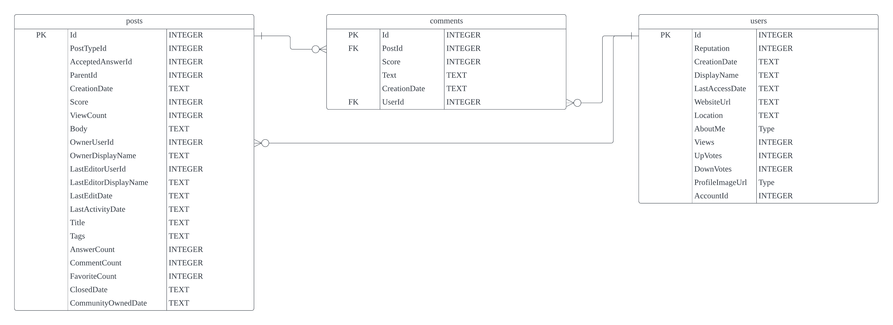

# ChatData User Interaction Analysis

## Introduction

This project aims to analyze user interactions on ChatData sites to gain insights into how the platform is used in the real world. By examining user activities such as posts, comments, and user profiles, we can understand which features are popular among users and identify opportunities for introducing new features.

## Entity Relationship Diagram (ERD)

To understand the structure of the database, we've created an Entity Relationship Diagram, which can be viewed below.

## Data Sources

The dataset for this analysis consists of three separate CSV files:
- `posts.csv`: Contains information about user posts.
- `comments.csv`: Contains information about comments made by users.
- `users.csv`: Contains user profile data.

## Database Setup

SQLite is used in this project, a lightweight database management system, to store and query the data. To create the database and load the data, follow the steps outlined in the Data Loading section in the Jupyter Notebook.

## Queries and Analysis

To answer specific questions about user engagement and interactions, I have created SQL queries. These queries can be found in the Queries section in the Jupyter Notebook. The notebook provides detailed explanations and insights obtained from the data.

## Data Standards

For best practices and guidelines on working with ChatData's data, I refer to the Data Standards document.

## Project Workflow

1. **ERD Creation**: Start by creating an Entity Relationship Diagram to understand the database structure.

2. **Database Setup**: Use SQLite to create the database and load the data from the CSV files. Refer to the Data Loading section in the Jupyter Notebook for guidance.

3. **Query Analysis**: Execute SQL queries to analyze user engagement. Find the queries in the Queries section in the Jupiter Notebook.

4. **Documentation**: Ensure that all queries are documented and recorded in the queries table within the SQLite database.

## Results Presentation

The results of this analysis will be presented in the `chat_data.ipynb` notebook and `slide_show` ppt.

